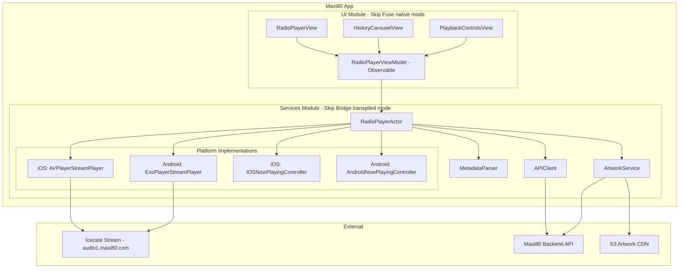
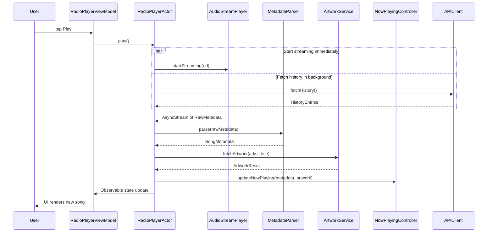
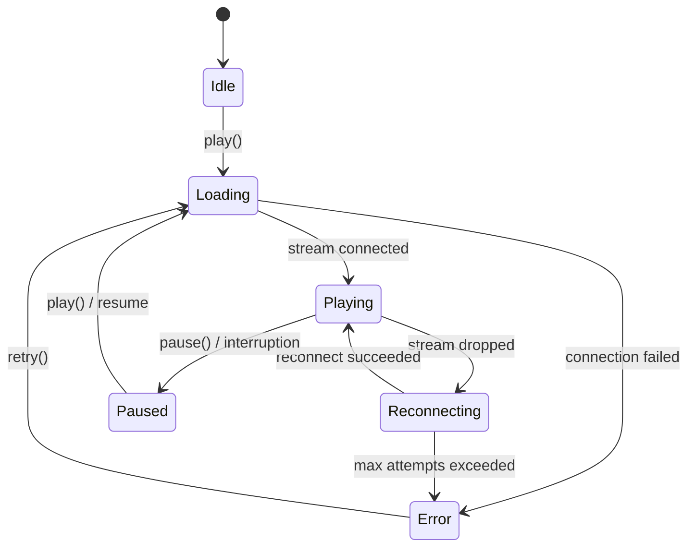

# Design Document: Maxi80 Radio Player

## Overview

The Maxi80 Radio Player is a cross-platform iOS/Android live radio streaming application built with the Skip framework. It streams audio from an Icecast server, extracts ICY metadata for now-playing information, fetches album artwork from a backend API, and integrates with platform-native media controls for background playback.

The architecture leverages Skip's dual-mode approach: a **Fuse (native) UI module** for shared SwiftUI views and an **Bridge (transpiled) services module** for platform-specific audio, media session, and networking code. Swift 6 strict concurrency (actors, async/await, AsyncStream) ensures thread safety across the reactive pipeline from stream metadata to UI updates.

### Key Design Decisions

1. **@MainActor coordinator pattern**: A `RadioPlayerCoordinator` (`@MainActor`, `ObservableObject`) centralizes state (playback, metadata, history) in the native module where Swift's full concurrency features are available.
2. **Callback-based bridging**: Platform-specific code in the transpiled module communicates via closure callbacks (`onMetadataChanged`, `onRemoteCommand`, `onError`) — the simplest types that bridge cleanly between Swift and Kotlin.
3. **Class-based platform abstraction**: `AudioStreamPlayer` and `NowPlayingController` are classes (not protocols/actors) with platform implementations inside `#if !SKIP_BRIDGE` → `#if SKIP` / `#else` guards — following the standard Skip transpiled module pattern.
4. **Artwork pipeline with caching**: A dedicated `ArtworkService` in the native module handles API lookups, image downloads, dominant-color extraction, and in-memory caching.
5. **Single-source-of-truth history**: The carousel is driven by an in-memory `[HistoryEntry]` array seeded from the API on start and appended from live metadata — never re-fetched during a session.

## Architecture

### System Architecture Diagram



### Data Flow



### Module Layout

```
Package.swift                          # SPM manifest with SKIP_BRIDGE conditional
├── Sources/
│   ├── Maxi80/                        # UI Module (Skip Fuse, native mode)
│   │   ├── Skip/
│   │   │   └── skip.yml              # mode: 'native'
│   │   ├── RadioPlayerView.swift
│   │   ├── HistoryCarouselView.swift
│   │   ├── PlaybackControlsView.swift
│   │   ├── ArtworkView.swift
│   │   ├── VolumeSliderView.swift
│   │   ├── RadioPlayerViewModel.swift
│   │   └── Maxi80App.swift
│   │
│   └── Maxi80Services/               # Services Module (Skip Bridge, transpiled mode)
│       ├── Skip/
│       │   └── skip.yml              # mode: 'transpiled', bridging: true, gradle deps
│       ├── RadioPlayerCoordinator.swift
│       ├── Models/
│       │   ├── Station.swift
│       │   ├── SongMetadata.swift
│       │   ├── HistoryEntry.swift
│       │   └── PlaybackState.swift
│       ├── Protocols/
│       │   ├── AudioStreamPlayer.swift
│       │   └── NowPlayingController.swift
│       ├── Services/
│       │   ├── APIClient.swift
│       │   ├── ArtworkService.swift
│       │   └── MetadataParser.swift
│       └── Platform/
│           ├── iOS/
│           │   ├── AVPlayerStreamPlayer.swift
│           │   └── IOSNowPlayingController.swift
│           └── Android/
│               ├── ExoPlayerStreamPlayer.swift
│               └── AndroidNowPlayingController.swift
├── Darwin/                            # iOS app entry point
│   └── Sources/Main.swift
└── Android/                           # Android app entry point
    └── app/
        ├── src/main/kotlin/Main.kt
        └── build.gradle.kts           # Media3/ExoPlayer dependencies
```

## Components and Interfaces

### AudioStreamPlayer Protocol

The core abstraction for platform audio. Implementations live inside `#if !SKIP_BRIDGE` with nested `#if SKIP` / `#else` guards (the standard Skip transpiled module pattern).

**Skip Transpiled Module Pattern:**
```swift
#if !SKIP_BRIDGE
// Bridge compiler skips this — generates stubs from public API surface only

#if SKIP
// Android implementation (transpiled to Kotlin)
#else
// iOS implementation (compiled as native Swift)
#endif

#endif // !SKIP_BRIDGE
```

```swift
/* SKIP @bridge */
public class AudioStreamPlayer: ObservableObject {
    @Published public var isPlaying: Bool = false
    @Published public var volume: Float = 1.0
    
    /// Callback invoked when new ICY metadata is received.
    public var onMetadataChanged: ((String) -> Void)?
    
    /// Callback invoked when an error occurs.
    public var onError: ((String) -> Void)?
    
    /// Callback invoked when an audio interruption occurs.
    public var onInterruption: ((Bool) -> Void)?  // true = began, false = ended with resume
    
    public init() { }
    
    /// Start streaming from the given URL.
    public func play(url: String) { }
    
    /// Stop streaming and release resources.
    public func stop() { }
    
    /// Set the audio output volume (0.0 to 1.0).
    public func setVolume(_ volume: Float) { }
}
```

**Note on bridging constraints:** Skip Bridge requires simple types for the public API surface. Callbacks use closures (not AsyncStream) because closures bridge cleanly between Swift and Kotlin. The native UI module consumes these callbacks to update its state.

**iOS Implementation** (`AVPlayerStreamPlayer`):
- Uses `AVPlayer` with `AVPlayerItem` pointing to the Icecast URL
- Configures `AVAudioSession` with `.playback` category for background support
- Attaches `AVPlayerItemMetadataOutput` delegate for ICY metadata callbacks
- Bridges delegate callbacks into the returned `AsyncStream<String>` via `AsyncStream.Continuation`
- Handles `AVAudioSession.interruptionNotification` for interruption events
- Handles `AVAudioSession.routeChangeNotification` for headphone disconnect (`.oldDeviceUnavailable`)

**Android Implementation** (`ExoPlayerStreamPlayer`):
- Uses `androidx.media3.exoplayer.ExoPlayer` with `MediaItem.fromUri(streamUrl)`
- Extends `MediaSessionService` for foreground playback with notification
- Implements `Player.Listener.onMediaMetadataChanged` for ICY metadata
- Manages `AudioFocusRequest` for audio focus handling
- Registers `BroadcastReceiver` for `ACTION_AUDIO_BECOMING_NOISY`
- Creates `MediaSession` for lock-screen / notification controls

### NowPlayingController Protocol

```swift
/* SKIP @bridge */
public class NowPlayingController {
    /// Update the published now-playing metadata.
    public func updateNowPlaying(artist: String, title: String, artworkURL: String?, isPlaying: Bool) { }
    
    /// Update only the playback state (rate: 1.0 playing, 0.0 paused).
    public func updatePlaybackState(isPlaying: Bool) { }
    
    /// Callback invoked when remote command received from lock screen/notification.
    public var onRemoteCommand: ((String) -> Void)?  // "play", "pause", "togglePlayPause"
    
    /// Tear down the media session.
    public func tearDown() { }
    
    public init() { }
}
```

**Note:** Uses `String` for command type and artwork URL rather than enums/URL types — simple types bridge cleanly between Swift and Kotlin via Skip Bridge.

**iOS Implementation** (`IOSNowPlayingController`):
- Sets `MPNowPlayingInfoCenter.default().nowPlayingInfo` with metadata
- Registers commands on `MPRemoteCommandCenter.shared()` (play, pause, togglePlayPause)
- Reports `isLiveStream = true`, `playbackRate` = 1.0 or 0.0, `elapsedPlaybackTime` = 0

**Android Implementation** (`AndroidNowPlayingController`):
- Managed by the `MediaSessionService` — the `MediaSession` automatically publishes metadata from `Player.mediaMetadata`
- Sets `MediaMetadata.Builder()` with title, artist, artworkUri
- Playback state reflected automatically via `Player.isPlaying`

### MetadataParser

A pure-function utility (no platform dependencies, fully testable):

```swift
/* SKIP @bridge */
public struct MetadataParser: Sendable {
    /// Parse an ICY metadata string "Artist - Title" into structured SongMetadata.
    public static func parse(_ rawString: String) -> SongMetadata {
        let separator = " - "
        guard let range = rawString.range(of: separator) else {
            return SongMetadata(artist: "", title: rawString.trimmingCharacters(in: .whitespaces))
        }
        let artist = String(rawString[rawString.startIndex..<range.lowerBound])
        let title = String(rawString[range.upperBound...])
        return SongMetadata(artist: artist, title: title)
    }
    
    /// Format a SongMetadata back to the canonical "Artist - Title" string.
    public static func format(_ metadata: SongMetadata) -> String {
        if metadata.artist.isEmpty {
            return metadata.title
        }
        return "\(metadata.artist) - \(metadata.title)"
    }
}
```

### APIClient

```swift
/* SKIP @bridge */
public class APIClient {
    private let baseURL: String
    private let apiKey: String
    
    public init(baseURL: String, apiKey: String) {
        self.baseURL = baseURL
        self.apiKey = apiKey
    }
    
    /// Fetch station metadata. Calls completion on main thread.
    public func fetchStation(completion: @escaping (String?) -> Void) { }
    
    /// Fetch artwork URL for a given artist/title. Returns nil JSON on HTTP 204.
    public func fetchArtworkURL(artist: String, title: String, completion: @escaping (String?) -> Void) { }
    
    /// Fetch song history entries as JSON string.
    public func fetchHistory(completion: @escaping (String?) -> Void) { }
}
```

**Note:** The bridged API uses String-based JSON responses and completion closures for cross-platform compatibility. The native module wraps this with async/await and Codable parsing in `RadioPlayerCoordinator`. All requests include `X-API-Key` header. Uses URLSession on iOS and OkHttp (via Skip transpilation) on Android.

### ArtworkService

Lives in the **native (Fuse) UI module** — handles image loading, caching, and color extraction using platform-native image APIs available through SkipFuseUI.

```swift
/// In the Maxi80 (native) module
@MainActor
public final class ArtworkService: ObservableObject {
    private let apiClient: APIClient
    private var cache: [String: ArtworkResult] = [:]  // key: "artist|title"
    
    /// Fetch artwork for a song. Returns cached result if available.
    public func fetchArtwork(artist: String, title: String) async -> ArtworkResult { ... }
    
    /// Extract dominant color from an image for gradient background.
    public func dominantColor(from image: PlatformImage) -> PlatformColor { ... }
}

public struct ArtworkResult {
    public let image: PlatformImage?
    public let dominantColor: PlatformColor
    public let isDefault: Bool  // true when using default Maxi80 cover
}
```

### RadioPlayerCoordinator (Central Coordinator)

Lives in the **native (Fuse) UI module** — NOT in the transpiled services module. This means it can use actors, async/await, and Swift concurrency freely since it doesn't need to bridge.

```swift
/// In the Maxi80 (native) module — no bridging constraints
@MainActor
public final class RadioPlayerCoordinator: ObservableObject {
    private let player: AudioStreamPlayer
    private let nowPlaying: NowPlayingController
    private let apiClient: APIClient
    private let artworkService: ArtworkService
    
    // Published state (observed by ViewModel)
    @Published public var playbackState: PlaybackState = .idle
    @Published public var currentSong: SongMetadata?
    @Published public var currentArtwork: ArtworkResult?
    @Published public var history: [HistoryEntry] = []
    @Published public var station: Station?
    @Published public var errorMessage: String?
    
    // Reconnection state
    private var reconnectAttempts: Int = 0
    private let maxReconnectAttempts = 3
    
    public func play() async { }
    public func pause() { }
    public func setVolume(_ volume: Float) { }
    public func retryConnection() async { }
}
```

**`play()` implementation note:** When the user taps play, the coordinator starts audio streaming immediately and launches `fetchHistory()` concurrently in a detached `Task`. This ensures audio begins as quickly as possible without waiting for the history API response. Once history arrives, it seeds the carousel in the background.

**Architecture note:** The coordinator consumes the bridged `AudioStreamPlayer` and `NowPlayingController` via their callback closures (`onMetadataChanged`, `onRemoteCommand`) and translates them into `@Published` state for SwiftUI observation. This keeps all concurrency and state management in the native module where Swift's full feature set is available.
```

### RadioPlayerViewModel

Lives in the UI module, bridges actor state to SwiftUI:

```swift
@Observable
public final class RadioPlayerViewModel {
    // UI-bound state
    public var isPlaying: Bool = false
    public var isLoading: Bool = false
    public var currentSong: SongMetadata?
    public var currentArtwork: PlatformImage?
    public var dominantColor: PlatformColor = .defaultBackground
    public var history: [HistoryEntry] = []
    public var station: Station?
    public var volume: Float = 1.0
    public var errorMessage: String?
    public var canShare: Bool = false
    public var selectedHistoryIndex: Int = 0
    
    // Displayed metadata (current live or selected history entry)
    public var displayedArtist: String { ... }
    public var displayedTitle: String { ... }
    
    // Actions
    public func togglePlayback() async { ... }
    public func setVolume(_ volume: Float) async { ... }
    public func retry() async { ... }
    public func shareCurrentTrack() -> ShareContent { ... }
}
```

## Data Models

```swift
/* SKIP @bridge */
public struct Station: Sendable, Codable {
    public let name: String
    public let streamUrl: URL
    public let image: URL
    public let shortDesc: String
    public let longDesc: String
    public let websiteUrl: URL
    public let donationUrl: URL
    public let defaultCoverUrl: URL
}

/* SKIP @bridge */
public struct SongMetadata: Sendable, Equatable, Codable {
    public let artist: String
    public let title: String
}

/* SKIP @bridge */
public struct HistoryEntry: Sendable, Identifiable, Codable {
    public let id: UUID
    public let artist: String
    public let title: String
    public let artwork: URL?
    public let timestamp: Date
    
    public var songMetadata: SongMetadata {
        SongMetadata(artist: artist, title: title)
    }
}

/* SKIP @bridge */
public enum PlaybackState: Sendable {
    case idle
    case loading
    case playing
    case paused
    case error(String)
    case reconnecting(attempt: Int)
}
```

## Correctness Properties

*A property is a characteristic or behavior that should hold true across all valid executions of a system — essentially, a formal statement about what the system should do. Properties serve as the bridge between human-readable specifications and machine-verifiable correctness guarantees.*

### Property 1: ICY Metadata Round-Trip

*For any* SongMetadata value (including cases where artist is empty, title is empty, or both contain Unicode/special characters), formatting the metadata to the canonical "Artist - Title" string and then parsing the result SHALL produce a SongMetadata equivalent to the original. Additionally, *for any* raw ICY metadata string, parsing it and then formatting the result and parsing again SHALL produce a SongMetadata equivalent to the first parse.

**Validates: Requirements 4.2, 4.3, 4.6**

### Property 2: History Append Preserves Order and Size

*For any* history list of length N and any new SongMetadata entry appended as a HistoryEntry, the resulting history list SHALL have length N+1, and the element at index N (last position) SHALL contain the artist and title matching the appended entry.

**Validates: Requirements 6.5, 6.6**

### Property 3: Displayed Metadata Matches Selected History Index

*For any* non-empty history list and any valid index i (0 ≤ i < history.count), the displayed artist and title SHALL equal the artist and title of `history[i]`.

**Validates: Requirements 6.7**

### Property 4: Artwork Cache Idempotence

*For any* artist/title pair, calling `fetchArtwork(artist:title:)` multiple times with the same arguments SHALL return an equivalent `ArtworkResult` each time (the cache is deterministic for a given input).

**Validates: Requirements 5.2**

### Property 5: Station Fallback Chain

*For any* station metadata API failure scenario: IF a previously cached Station exists, the system SHALL return that cached Station; IF no cached Station exists, the system SHALL return a Station with name equal to "Maxi 80" and shortDesc equal to "La radio de toute une génération".

**Validates: Requirements 8.5, 8.6**

### Property 6: Reconnection Backoff Sequence

*For any* sequence of N consecutive stream connection failures (1 ≤ N ≤ 3), the system SHALL schedule reconnection attempts with delays of 2^n seconds for each attempt n (yielding 2s, 4s, 8s). *For any* sequence exceeding 3 consecutive failures, the system SHALL cease reconnection attempts and transition to the error state.

**Validates: Requirements 12.2, 12.3**

### Property 7: Share Text Formatting

*For any* SongMetadata with non-empty artist and non-empty title, the generated share text SHALL equal exactly "I'm listening to {title} by {artist} on Maxi 80 via Maxi80 for iOS. Check it out at https://www.maxi80.com" with the actual title and artist values substituted.

**Validates: Requirements 17.2**

### Property 8: API Key Inclusion

*For any* HTTP request constructed by the APIClient (regardless of endpoint, query parameters, or request method), the request headers SHALL contain the key "X-API-Key" with a value equal to the configured API key string.

**Validates: Requirements 9.1**

## Error Handling

### Error Categories and Strategies

| Error Category | Example | Strategy |
|---|---|---|
| **Stream connection failure** | Network timeout, DNS failure | Display error message, auto-reconnect (3 attempts, exponential backoff) |
| **Stream interruption** | Network drop during playback | Same as connection failure — trigger reconnect sequence |
| **Audio interruption** | Phone call, alarm | Pause playback; resume automatically if resume option available |
| **API request failure** | Backend unreachable, timeout | Return cached data if available; degrade gracefully |
| **Authentication failure** | HTTP 401/403 from API | Log error, return typed error to caller. No retry (key is invalid). |
| **Artwork fetch failure** | Image download timeout | Display default Maxi80 cover image |
| **Metadata parse failure** | Unexpected ICY format | Treat entire string as title with empty artist (never crash) |
| **Audio route failure** | Bluetooth device disconnected abruptly | Fall back to device speaker, continue playback |

### Reconnection State Machine



### Error Propagation

- Platform player errors (AVPlayer error, ExoPlayer error) are caught in the platform layer and surfaced as Swift errors through the `AudioStreamPlayer` protocol.
- The `RadioPlayerActor` catches all errors, updates `playbackState` to `.error(message)` or `.reconnecting(attempt:)`, and notifies the ViewModel.
- The ViewModel exposes `errorMessage: String?` which the UI displays in a non-intrusive banner overlay.
- API errors never crash the app — all API methods return optionals or throw recoverable errors.

## Testing Strategy

### Property-Based Testing Library

**Library:** [SwiftCheck](https://github.com/typelift/SwiftCheck) with Swift Testing framework (`@Test`)

SwiftCheck provides `Arbitrary` protocol conformance and `Gen<T>` generators for property-based testing in Swift. Each property test runs a minimum of **100 iterations** with shrinking enabled to find minimal counterexamples.

### Property-Based Tests

Each correctness property maps to a single property-based test:

| Property | Test Target | Generator Strategy |
|---|---|---|
| P1: ICY round-trip | `MetadataParser` | `Gen<SongMetadata>` with arbitrary Unicode artist/title strings (including empty artist); also `Gen<String>` raw ICY strings with/without " - " |
| P2: History append | `[HistoryEntry]` + `SongMetadata` | `Gen<[HistoryEntry]>` of random length + `Gen<SongMetadata>` for new entry |
| P3: Displayed metadata index | `RadioPlayerViewModel` logic | `Gen<[HistoryEntry]>` (non-empty) + `Gen<Int>` valid index within bounds |
| P4: Artwork cache | `ArtworkService` | `Gen<(String, String)>` artist/title pairs, mock API returning deterministic URLs |
| P5: Station fallback | Station resolution logic | `Gen<Station?>` (optional cached) + simulated API failure |
| P6: Reconnection backoff | Reconnection logic | `Gen<Int>` failure counts (1-5), verify delay sequence and max cap |
| P7: Share formatting | Share text builder | `Gen<SongMetadata>` with non-empty artist/title, verify template match |
| P8: API key inclusion | `APIClient` request builder | `Gen<APIEndpoint>` (station, artwork, history with random params), inspect headers |

**Test Tagging Convention:**
```swift
// Feature: maxi80-radio-player, Property 1: ICY Metadata Round-Trip
@Test func icyMetadataRoundTrip() {
    property("parse(format(metadata)) == metadata") <- forAll { (metadata: SongMetadata) in
        MetadataParser.parse(MetadataParser.format(metadata)) == metadata
    }
}
```

### Unit Tests (Example-Based)

Focused on specific scenarios, edge cases, and integration points:

- **MetadataParser edge cases**: empty string, " - " only, multiple separators ("A - B - C"), leading/trailing whitespace, Unicode characters (emoji, CJK)
- **APIClient responses**: valid Station JSON, HTTP 204 for artwork, HTTP 401/403 error handling, malformed JSON, network timeout
- **PlaybackState transitions**: idle→loading→playing, playing→paused, playing→reconnecting→error
- **ViewModel state**: station info displayed when idle, station info as placeholder during initial stream, share button disabled when no metadata, displayed metadata switches on history index change
- **ArtworkService**: default cover on 204, default cover on network failure, previous artwork retained during loading

### Integration Tests

- Audio stream connection and first metadata delivery (platform-specific device test)
- Background playback continuity across foreground/background lifecycle transitions
- Now Playing controls: publish metadata → tap pause on lock screen → verify player pauses
- API endpoint integration against staging backend (station, artwork, history)
- Audio interruption: simulate phone call → verify pause → end call → verify resume

### UI Tests

- History carousel: swipe left/right navigates entries, current song positioned rightmost
- Portrait/landscape layout adaptation without content clipping
- AirPlay picker button visibility (iOS) / absence (Android)
- Error banner display on connection failure, retry button triggers reconnection
- Volume slider reflects system volume changes
- Share sheet presents with correct text and artwork attachment
